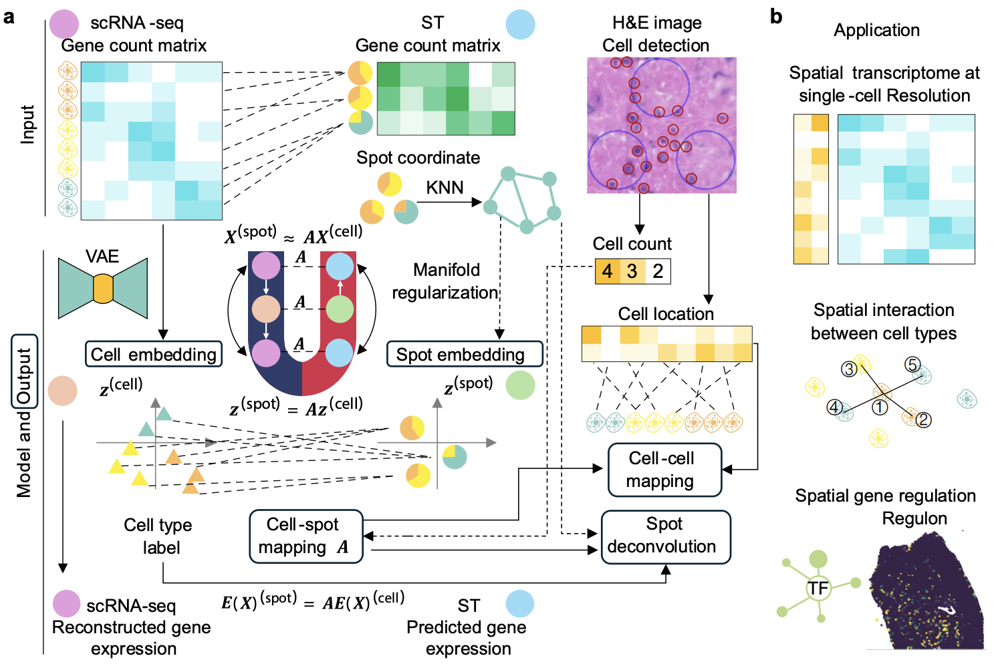

# Deeply Mapping Cell and Spot in Joint Latent Space

scMagnet is a deep learning framework designed to bridge the technological gap between scRNA-seq and spatial transcriptomics (ST) by reconstructing genome-wide spatial transcriptomes at single-cell resolution. Utilizing a robust triple alignment strategy across count and latent spaces—guided by manifold regularization—our method accurately maps scRNA-seq cells to ST spots and directly to detected cells in tissue images. The framework takes standard scRNA-seq and spatial data as input to output high-fidelity cell-to-spot mappings. Beyond spatial reconstruction, scMagnet empowers downstream analyses, including the precise estimation of spatial gene regulation patterns and the identification of key regulatory modules across different biological conditions.

## 📌 Overview

  

Single‑cell RNA‑seq (scRNA‑seq) captures gene expression at high resolution but loses spatial context, while spatial transcriptomics (ST) retains tissue architecture but at lower cellular resolution. This project bridges the two modalities by learning a **joint embedding** where cells from scRNA‑seq and spots from ST are mapped to a common latent space. The learned representations can be used for:

- Aligning cell types with spatial locations  
- Predicting unmeasured gene expression in spatial data  
- Integrating multiple datasets across technologies

## Dependencies and Environment

We recommend using Conda. The provided `environment.yml` lists the packages required.

Create and activate the environment:

```bash
conda env create -f environment.yml
conda activate GPU
```

Note: `environment.yml` contains GPU-specific PyTorch versions. If you do not have a CUDA-enabled GPU, replace `torch` with a CPU build compatible with your platform.

## Preparing Input Data

The main script expects these files in the repository root (or update the paths in the scripts accordingly):

- `scRNA_subsampled_20k.h5ad`
- `Visium_FAD.h5ad`
- `20k_markers.npy`
- `harmony_embedding.txt`
- `spot_loc_with_counts_r_f.csv`
- `S3_GT.txt`

Some datasets are too large to include, you can find them here: https://drive.google.com/drive/folders/1Vf8iVi29hQqXOYWpDYSgmuAbWvS5l6XL?usp=sharing, place them in a `data/` directory and modify the paths in `JointEmbedding4.py`.

## How to Run
Run the primary experiment with:

```bash
python JointEmbedding4.py
```

This script performs two main stages:
1. Train encoder/decoder (Stage 1) and save model checkpoints to `SpatialVG_improved_NMF/models/`.
2. Optimize assignment matrix `A` (Stage 2) and produce final predictions and evaluation.

A visualization helper:

```bash
python DrawPicture2.py
```

## Expected Outputs

After a successful run, the script generates files such as:

- `SpatialVG_improved_NMF/models/fix_enc_pca1_top5000_kl_soft_harm-best_result0.5-withmarker2testforzhou.pth`
- `SpatialVG_improved_NMF/models/fix_enc_pca1_top5000_kl_soft_harm_getA2forzhou.pth`
- `fix_enc_pca1_top5000_kl_soft_harm_fval.npy`
- `fix_enc_pca1_top5000_kl_soft_harm_z_cell.npy`
- `pcc_list_oursbest1.csv`

## Notes and Recommendations

- If your machine lacks a GPU, set the device to CPU in `JointEmbedding4.py` (change `cuda:5` to `cpu` or `cuda:0`).
- Ensure `Visium_FAD.h5ad` includes `adata.obsm['spatial']` or adapt the script to use coordinates from another column.
- For quick testing, use smaller h5ad files or subsets of the data before running full-scale experiments.

## Repository Structure

- `JointEmbedding4.py`: Main experiment script containing training, evaluation, and optimization flows.
- `DrawPicture2.py`: Visualization utilities for spatial plots and embeddings.
- `environment.yml`: Conda environment specification for reproducibility.
- `README.md`: Original README; this file is an enhanced English version.
- `20k_markers.npy`: Marker gene list used by the scripts.
- `harmony_embedding.txt`: PCA/embedding guidance used during training.
- `spot_loc_with_counts_r_f.csv`: Spot metadata used for adjacency and smoothing.
- Additional folders: `compare/`, `dataGithub/`, `method/` contain comparisons, auxiliary data, and notebooks.


## Contact

For questions or collaboration, please open an issue or reach out to the repository owner.
